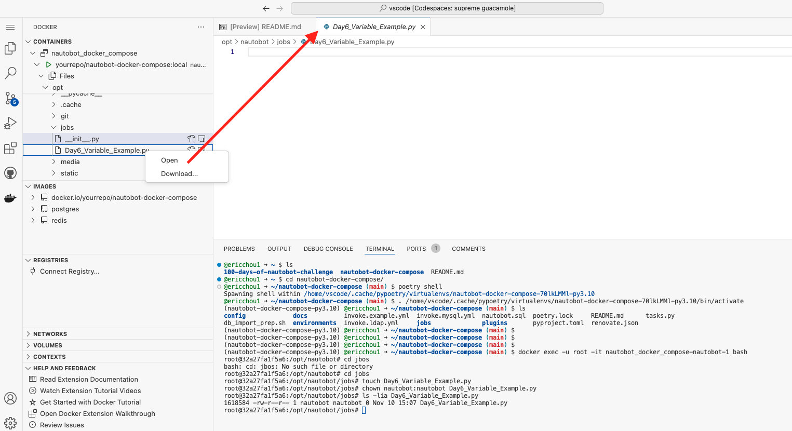
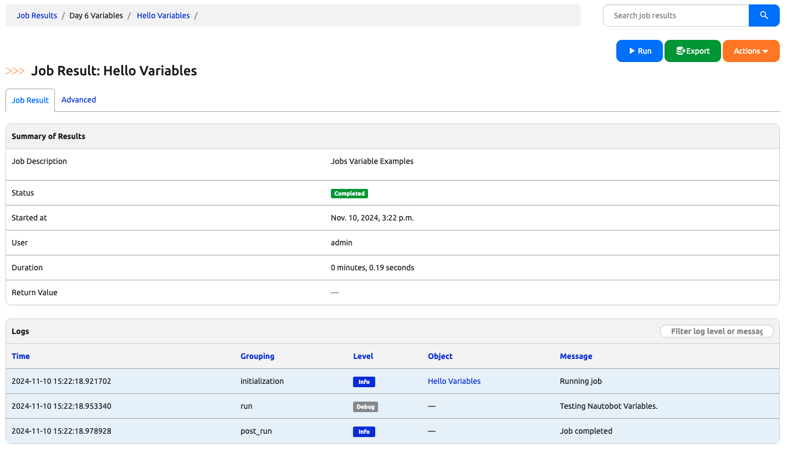
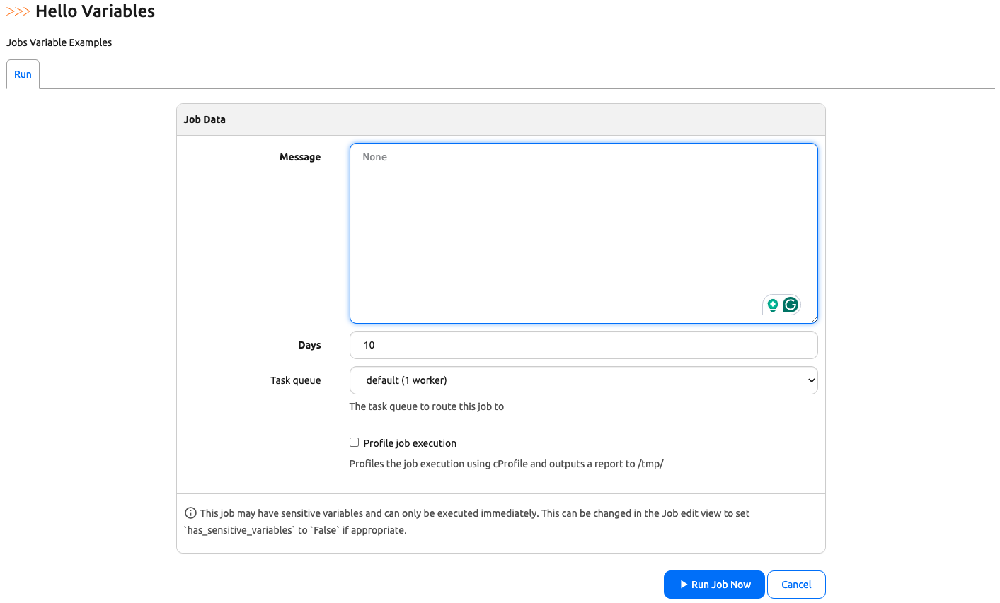
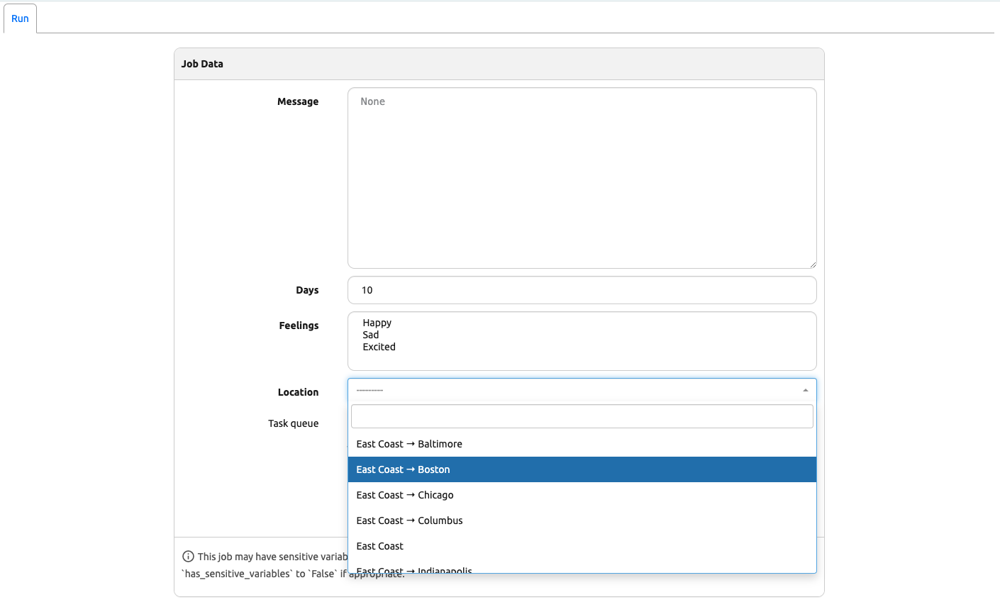

# Object as Variables

In today's challenge, we are going to touch on another foundational topic when it comes to writing Nautobot jobs: [Nautobot Job variables](https://docs.nautobot.com/projects/core/en/stable/development/jobs/#variables).

Job variables is a convenient way to accept user input in the Nautobot Web UI that can connect to the data in the backend. We can then pass this value into the `run()` method to be used. 

Let's restart our stopped Codespace lab environment or create a new one. 

## Lab Environment Setup

The environment setup will be the same as [Lab Setup Scenario 1](../Lab_Setup/scenario_1_setup/README.md), below is a summary of the steps, please consult the guide for a detailed background if needed. 

> [!TIP]
> If you have stopped the Codespace environment and restart again but found the Docker daemon stopped working, please follow the steps in the setup guide to rebuild the environment. 

Here is a review of the steps to start Nautobot: 

```
$ cd nautobot-docker-compose/
$ poetry shell
$ invoke build
$ invoke db-import
$ invoke debug
```

Let's upload and prepare cEOS image and start Containerlab: 

> [!TIP]
> Please see [Lab Setup Scenario 1](../Lab_Setup/scenario_1_setup/README.md) for instructions on how to download Arista cEOS image

> [!WARNING]
> In the example below, the file was already unzipped, it does not have the `.zip` file extension. Please include the `.zip` extension as necessary.  

```
$ docker import cEOS64-lab-4.32.0F.tar ceos:4.32.0F
```

For this lab we only needed the BOS devices: 

> [!TIP] 
> The `clab` directory is at the top level of the `100-days-of-nautobot` directory. 

```
$ cd clab/
$ sudo containerlab deploy --topo ceos-lab.clab.yml --node-filter bos-acc-01,bos-rtr-01
```

We are ready to create our new job file. 

## Job File Creation 

Let's create a file for today's challenge. We can either do this via the shared directory or directly in the Nautobot docker container.  

> [!TIP]
> Take a look at [Day 003 Hello Jobs](../Day003_Hello_Jobs_Part_1/README.md) if you need a refresher. 

Let's begin by creating a file named `Day6_Variable_Example` on the Nautobot docker container under the `/opt/nautobot/jobs` directory (please feel free to create it via the shared directory if you'd prefer): 

1. Create the file under `/opt/nautobot/jobs`.
2. Change the file ownership to `nautobot:nautobot`.

```
(nautobot-docker-compose-py3.10) @ericchou1 ➜ ~/nautobot-docker-compose (main) $ docker exec -u root -it nautobot_docker_compose-nautobot-1 bash

root@32a27fa1f5a6:/opt/nautobot# cd jobs
root@32a27fa1f5a6:/opt/nautobot/jobs# touch Day6_Variable_Example.py

root@32a27fa1f5a6:/opt/nautobot/jobs# chown nautobot:nautobot Day6_Variable_Example.py 

root@32a27fa1f5a6:/opt/nautobot/jobs# ls -lia Day6_Variable_Example.py 
1618584 -rw-r--r-- 1 nautobot nautobot 0 Nov 10 15:07 Day6_Variable_Example.py
```

We can right-click on the file to edit it in the main window: 



Let's pick up where `HelloJobs.py` left off and fill in some boilerplate code to see the job show up in our UI: 

```python
from nautobot.apps.jobs import MultiChoiceVar, Job, ObjectVar, register_jobs, TextVar, IntegerVar

name = "Day 6 Variables"

class HelloVariables(Job):

    class Meta:

        name = "Hello Variables"
        description = "Jobs Variable Examples"

    def run(self):
        self.logger.debug("Testing Nautobot Variables.")

register_jobs(
    HelloVariables,
)
```

Don't forget to do a `invoke post-upgrade` in a separate terminal window to register the job: 

```
@ericchou1 ➜ ~ $ cd nautobot-docker-compose/
@ericchou1 ➜ ~/nautobot-docker-compose (main) $ poetry shell
nautobot-docker-compose (main) $ invoke post-upgrade
```

We should see the job show up under Jobs: 


Enable the Job: 


Then run it: 



## Adding Variables

Noticed we imported a few additional objects for our file: 

```python
from nautobot.apps.jobs import MultiChoiceVar, Job, ObjectVar, register_jobs, TextVar, IntegerVar
```

We can add a `TextVar` and `IntegerVar` to the file: 

```python
from nautobot.apps.jobs import MultiChoiceVar, Job, ObjectVar, register_jobs, TextVar, IntegerVar

name = "Day 6 Variables"

class HelloVariables(Job):

    message = TextVar() 
    days = IntegerVar(
        default="10"
    )

    class Meta:
        name = "Hello Variables"
        description = "Jobs Variable Examples"

    def run(self, message, days):
        self.logger.debug(f"Please give the message: {message} in {days} days.")

register_jobs(
    HelloVariables,
)
```

Notice we need to pass in the variables, in this case "messages" and "age", to the `run()` method in order to be used. 

We should be able to see the additional fields on the run job page when we try to run the job again: 



If we enter "Happy New Year!" for the message and "45" for Days, we should see the following result: 


Let's add a [MultichoiceVar](https://docs.nautobot.com/projects/core/en/stable/development/jobs/#choicevar) value in the form of (value, label) for our inputs: 

```python
class HelloVariables(Job):
    ...
    CHOICES = (
        ('h', 'Happy'),
        ('s', 'Sad'),
        ('e', 'Excited')
    )
    feelings = MultiChoiceVar(choices=CHOICES)
    ...
    def run(self, message, days, feelings):
        self.logger.debug(f"Please give the message: {message} in {days} days.")
        self.logger.info(f"I am feeling {feelings}!")

```

We can see the additional choices show up in the run page: 


Notice the result we receive in the `run()` is the value and not the label: 


If we take a step back and think about all the HTML and Django code we have to write for all previous form inputs, we can certainly appreciate the simplicity of Nautobot variables. 

In the next example, we will see how we can tie the variable with our database models using `ObjectVar`. 

## Connect ObjectVar with Data

With just few lines of code, `ObjectVar` allows us to tie our code with the database objects. We will use it extensively in our future challenges. 

Let's see an example of it with the location database. We will need to import the object first, then we can use `ObjectVar` to reference it in our code: 

```python
from nautobot.dcim.models.locations import Location 
...
class HelloVariables(Job):
    ...
    location = ObjectVar(model=Location,)
    def run(self, message, days, feelings, location):
        ...
        self.logger.info(f"Pick a location: {location}")
```

That is it! Now we have the user input a selection of the location from our location object: 



Here is the result:  


## Final Code

Here is the final code for today's challenge: 

```python
from nautobot.apps.jobs import MultiChoiceVar, Job, ObjectVar, register_jobs, TextVar, IntegerVar
from nautobot.dcim.models.locations import Location 

name = "Day 6 Variables"

class HelloVariables(Job):

    message = TextVar()
    days = IntegerVar(
        default="10"
    )

    CHOICES = (
        ('h', 'Happy'),
        ('s', 'Sad'),
        ('e', 'Excited')
    )
    feelings = MultiChoiceVar(choices=CHOICES)

    location = ObjectVar(model=Location,)

    class Meta:
        name = "Hello Variables"
        description = "Jobs Variable Examples"

    def run(self, message, days, feelings, location):
        self.logger.debug(f"Please give the message: {message} in {days} days.")
        self.logger.info(f"I am feeling {feelings}!")
        self.logger.info(f"Pick a location: {location}")

register_jobs(
    HelloVariables,
)
```

Remember we can also use the filtering method we learned from Day 005 to filter objects. 

## Day 6 To Do

Remember to stop and delete the codespace instance on [https://github.com/codespaces/](https://github.com/codespaces/). 

Go ahead and post a screenshot the job result page on a social media of your choice, make sure you use the tag `#100DaysOfNautobot` `#JobsToBeDone` and tag `@networktocode`, so we can share your progress! 

In tomorrow's challenge, we will start to do some data quality checks with Nautobot jobs. See you there! 

[X/Twitter](<https://twitter.com/intent/tweet?url=https://github.com/networktocode/100-days-of-nautobot-challenge&text=I+jst+completed+Day+6+of+the+100+days+of+nautobot+challenge+!&hashtags=100DaysOfNautobot,JobsToBeDone>)

[LinkedIn](https://www.linkedin.com/) (Copy & Paste: I just completed Day 6 of 100 Days of Nautobot, https://github.com/networktocode/100-days-of-nautobot-challenge, challenge! @networktocode #JobsToBeDone #100DaysOfNautobot)


