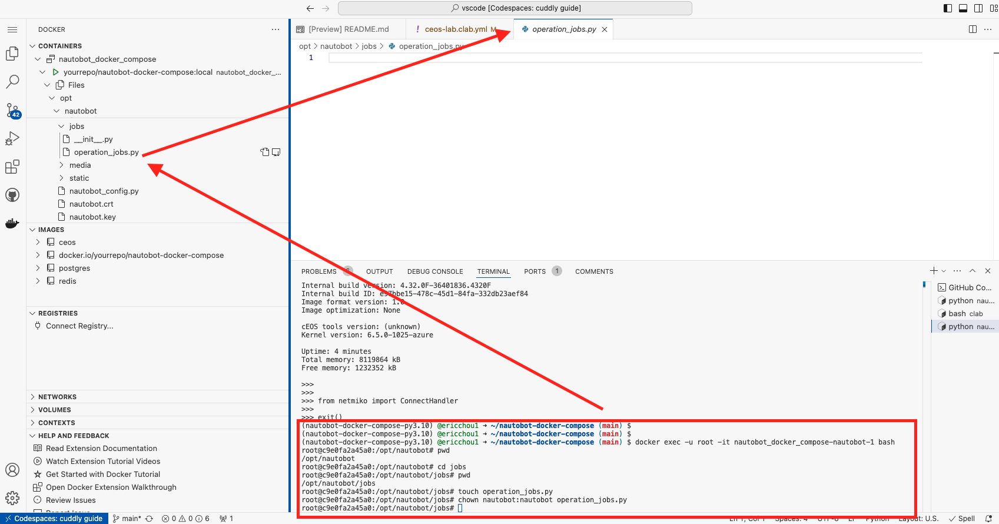
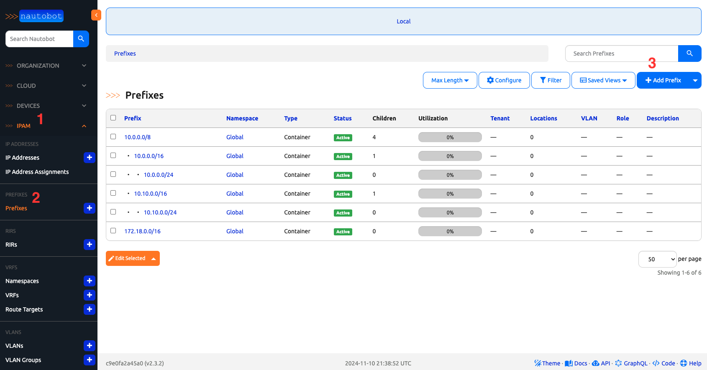
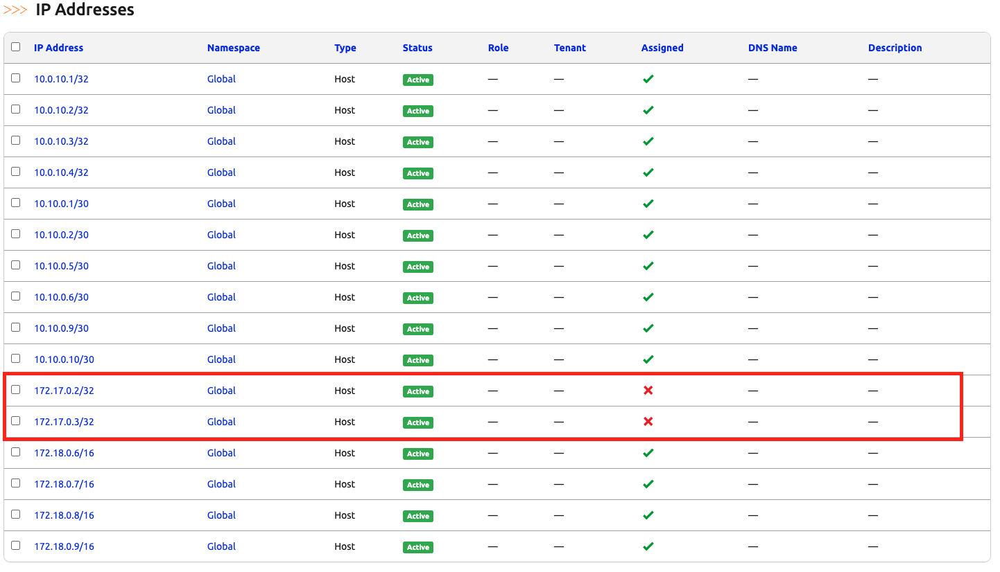
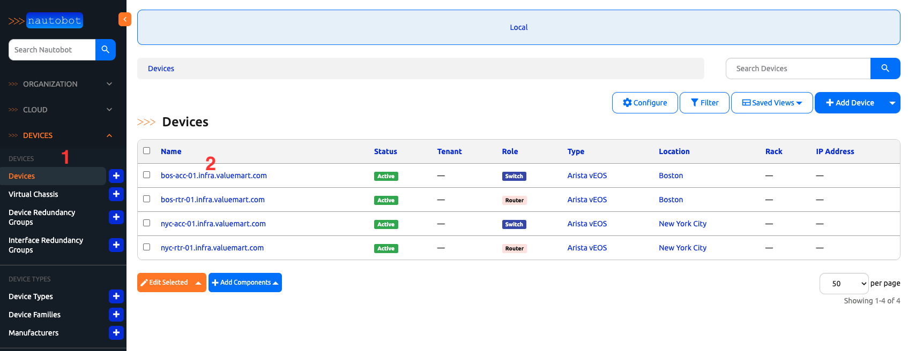
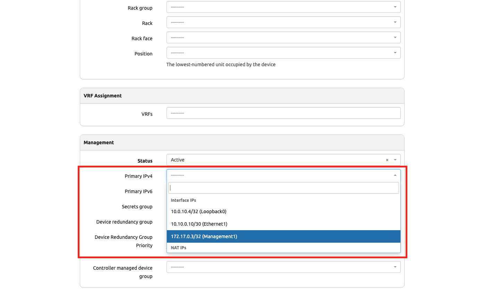
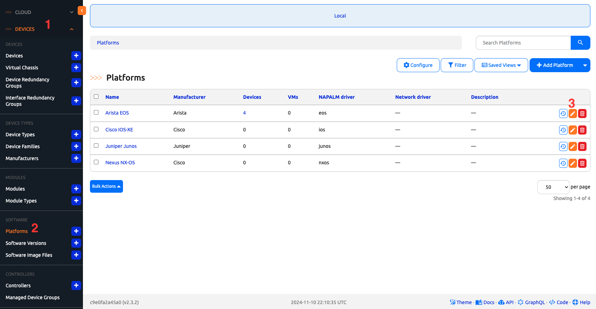
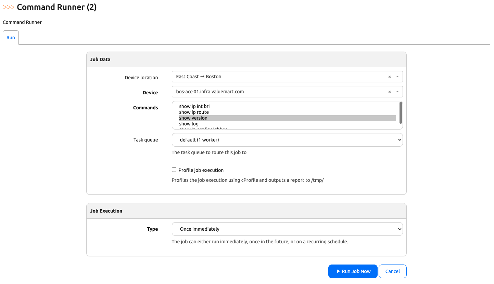
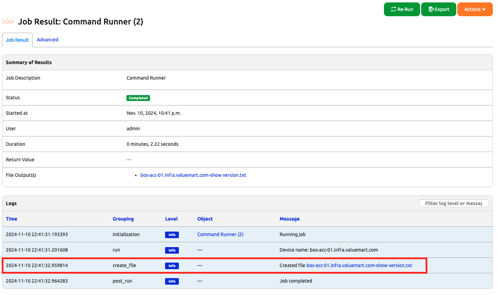

# Python Script to Jobs - Part 2

In Day 009's challenge, we uploaded the Arista cEOS image to our codespace environment, launch Containerlab, and tested connectivity from Nautobot to the devices using Netmiko library. 

In today's challenge, we will turn the Netmiko commands into a Nautobot job that we can execute from the UI. 

> [!WARNING]
> Please note the CPU will be high for a `2-core` machine in Codespace, you will either need to wait for the CPU to normalize or launch Codespace with a bigger machine type, such as `4-core`. 

> [!NOTE] 
> Please start the Nautobot environment within Codespace, here is a condensed version of the commands:  
> ```
> $ cd nautobot-docker-compose/
> $ poetry shell
> $ invoke build
> $ invoke db-import
> $ invoke debug
> ```
> We need to also launch the container lab, here is the command for importing the Arista cEOS image after upload: 
> ```
> docker import cEOS64-lab-4.32.0F.tar ceos:4.32.0F
> ```
> The containlerlab topology is sitting under the clab directory, again, we only needed the BOS devices for this challenge so feel free to comment out the NYC devices or use the `--node-filter` command: 
> ```
> $ cd clab/
> $ sudo containerlab deploy --topo ceos-lab.clab.yml 
> ```

Let's create the file needed for today's challenge. 

## Operations Job File

We will create a file named ```operation_jobs.py``` under the ```/opt/nautobot/jobs``` folder on the Nautobot docker instance: 

```
$ docker exec -u root -it nautobot_docker_compose-nautobot-1 bash
root@c9e0fa2a45a0:/opt/nautobot# cd jobs
root@c9e0fa2a45a0:/opt/nautobot/jobs# pwd
/opt/nautobot/jobs
root@c9e0fa2a45a0:/opt/nautobot/jobs# touch operation_jobs.py
root@c9e0fa2a45a0:/opt/nautobot/jobs# chown nautobot:nautobot operation_jobs.py
```

Once the file is created, we can open it on the main panel and start to work on it: 



We will build this job step-by-step. 

## IP Prefix and Address Assignment 

In order to communicate with the device, we will need to let Nautobot know the primary IP address of the devices. We will need to create an IP prefix list via "IPAM -> Prefixes": 



We can create a "172.17.0.0/16" prefix and set the status to "active": 


After the prefix is created, we can create individual IP addresses under "IPAM -> IP Address -> Add New IP address." We can create the "172.17.0.2/32" and "172.17.0.3/32" address in the "Global" namespace, type of "Network", and status of "Active": 


Notice the new addresses are not assigned at this point: 



We will assign the IP to the devices by going to the "DEVICES -> Devices" and click on the device to go into the detail view: 



In the device detail view, we will locate the Interfaces section and the Management1 interface: 


We can edit the management interface with the "Edit interface" bottom: 


Finally, scroll down to the IP address section and assign it with the previously created IP address: 


Once that is done, we can go back to the device detail page to assign that IP as the "Primary IPv4" address:



We should do this for all the devices we need to work with.

## Mapping Network Drivers

There is one additional thing we need to do, which is to tell Nautobot which network driver to use for the Arista EOS platform. This is a one time process that we need to do for all network platforms. 

We can do this by going to the "DEVICES -> Platforms" and edit the "Arista EOS" platform: 



We can use the "Show Configured Choices" to see all the options. The network driver for Arista is named "arista_eos":


Now we are ready to build our operations script. 

## Building the Script

The first step is to import the necessary database models and libraries. Some libraries imported here will be used for later, but there is no harm in importing them now: 

```python
import os

from django.conf import settings
from nautobot.apps.jobs import MultiChoiceVar, Job, ObjectVar, register_jobs, StringVar, IntegerVar
from nautobot.dcim.models.locations import Location
from nautobot.dcim.models.devices import Device
from nautobot.dcim.models.device_components import Interface
from netmiko import ConnectHandler
from nautobot.ipam.models import VLAN
from nautobot.apps.jobs import JobButtonReceiver
```

We will use the name "Network Operations" for our Nautobot jobs name: 

```python
name = "Network Operations"
```

Here we specify all the command choices we will allow the users to choose: 

```python
COMMAND_CHOICES = (
    ("show ip interface brief", "show ip int bri"),
    ("show ip route", "show ip route"),
    ("show version", "show version"),
    ("show log", "show log"),
    ("show ip ospf neighbor", "show ip ospf neighbor"),
)
```

Here is the main part of the script, we have seen most of the verification pieces. We added the Netmiko connection function after the verifications and output the result in a file: 

```python
class CommandRunner(Job):
    device_location = ObjectVar(model=Location, required=False)

    device = ObjectVar(
        model=Device,
        query_params={
            "location": "$device_location",
        },
    )

    commands = MultiChoiceVar(choices=COMMAND_CHOICES)

    class Meta:
        name = "Command Runner"
        has_sensitive_variables = False
        description = "Command Runner"

    def run(self, device_location, device, commands):
        self.logger.info("Device name: %s", device.name)
    
        # Verify that the device has a primary IP
        if device.primary_ip is None:
            self.logger.fatal("Device does not have a primary IP address set.")
            return

        # Verify that the device has a platform associated 
        if device.platform is None:
            self.logger.fatal("Device does not have a platform set.")
            return

        # check for device driver association
        if device.platform.network_driver_mappings.get("netmiko") is None:
            self.logger.fatal("Device mapping for Netmiko is not present, please set.")
            return

        # Connect to the device, get some output - comment this out if you are simulating
        net_connect = ConnectHandler(
            device_type=device.platform.network_driver_mappings["netmiko"],
            host=device.primary_ip.host,  # or device.name if your name is an FQDN
            # username=os.getenv("DEVICE_USERNAME"),  # change to use user_name
            # password=os.getenv("DEVICE_PASSWORD"),
            username="admin",
            password="admin",
        )
        for command in commands:
            output = net_connect.send_command(
                command
            )  
            self.create_file(f"{device.name}-{command}.txt", output)
```

Don't forget to register the job: 

```python
register_jobs(
    CommandRunner,
)
```

We can enable the job and test out the job: 



After execution, we can see the command is executed and output saved to a file that we can download: 



The output file contains the output of the command "show version":


## Final Script

Here is the final version of the scrip: 

```
import os

from django.conf import settings
from nautobot.apps.jobs import MultiChoiceVar, Job, ObjectVar, register_jobs, StringVar, IntegerVar
from nautobot.dcim.models.locations import Location
from nautobot.dcim.models.devices import Device
from nautobot.dcim.models.device_components import Interface
from netmiko import ConnectHandler
from nautobot.ipam.models import VLAN
from nautobot.apps.jobs import JobButtonReceiver


name = "Network Operations"


COMMAND_CHOICES = (
    ("show ip interface brief", "show ip int bri"),
    ("show ip route", "show ip route"),
    ("show version", "show version"),
    ("show log", "show log"),
    ("show ip ospf neighbor", "show ip ospf neighbor"),
)


class CommandRunner(Job):
    device_location = ObjectVar(model=Location, required=False)

    device = ObjectVar(
        model=Device,
        query_params={
            "location": "$device_location",
        },
    )

    commands = MultiChoiceVar(choices=COMMAND_CHOICES)

    class Meta:
        name = "Command Runner"
        has_sensitive_variables = False
        description = "Command Runner"

    def run(self, device_location, device, commands):
        self.logger.info("Device name: %s", device.name)
    
        # Verify that the device has a primary IP
        if device.primary_ip is None:
            self.logger.fatal("Device does not have a primary IP address set.")
            return

        # Verify that the device has a platform associated 
        if device.platform is None:
            self.logger.fatal("Device does not have a platform set.")
            return

        # check for device driver association
        if device.platform.network_driver_mappings.get("netmiko") is None:
            self.logger.fatal("Device mapping for Netmiko is not present, please set.")
            return

        # Connect to the device, get some output - comment this out if you are simulating
        net_connect = ConnectHandler(
            device_type=device.platform.network_driver_mappings["netmiko"],
            host=device.primary_ip.host,  # or device.name if your name is an FQDN
            # username=os.getenv("DEVICE_USERNAME"),  # change to use user_name
            # password=os.getenv("DEVICE_PASSWORD"),
            username="admin",
            password="admin",
        )
        for command in commands:
            output = net_connect.send_command(
                command
            )  
            self.create_file(f"{device.name}-{command}.txt", output)


register_jobs(
    CommandRunner,
)
```

We accomplish a lot in today's challenge, let's take a moment to celebrate! 

## Day 10 To Do

Remember to stop the codespace instance on [https://github.com/codespaces/](https://github.com/codespaces/). 

Go ahead and post a screenshot of the successful execution of the new job on a social media of your choice, make sure you use the tag `#100DaysOfNautobot` `#JobsToBeDone` and tag `@networktocode`, so we can share your progress! 

In tomorrow's challenge, we will enhance our operations job with VLAN changes. See you tomorrow! 

[X/Twitter](<https://twitter.com/intent/tweet?url=https://github.com/networktocode/100-days-of-nautobot-challenge&text=I+jst+completed+Day+10+of+the+100+days+of+nautobot+challenge+!&hashtags=100DaysOfNautobot,JobsToBeDone>)

[LinkedIn](https://www.linkedin.com/) (Copy & Paste: I just completed Day 10 of 100 Days of Nautobot, https://github.com/networktocode/100-days-of-nautobot-challenge, challenge! @networktocode #JobsToBeDone #100DaysOfNautobot)