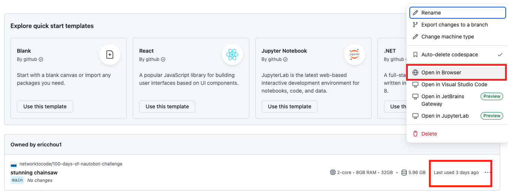
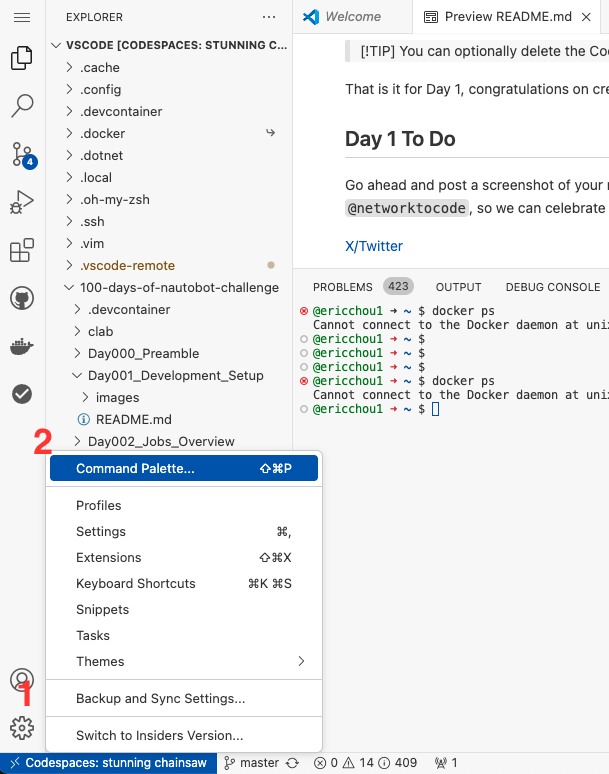
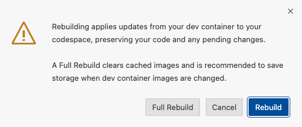
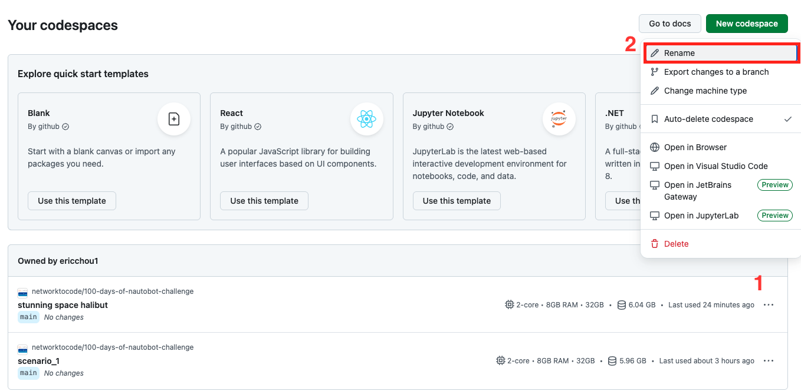

# Lab Related Notes

This document captures some of the notes related to the lab setup. 

## Rebuild Coespace

We have discovered sometimes after the codespace instance was stopped either manually or due to the preset timeout period, the Docker daemon would stop working. 

For example, this instance was stopped 3 days ago, and I restarted via "open in browser": 



In the terminal, docker daemon would appear to have stopped: 

```
@ericchou1 ➜ ~ $ docker ps
Cannot connect to the Docker daemon at unix:///var/run/docker.sock. Is the docker daemon running?
```

If this happens, we can rebuild the codespace by going to "Settings -> Command Pallette": 



Then type in "rebuild" to choose "Codesapces: Rebuild Containers": 


Pick "Rebuild" and proceed: 



After reloading the window, Docker daemon would be back running: 

```
@ericchou1 ➜ ~ $ docker ps
CONTAINER ID   IMAGE     COMMAND   CREATED   STATUS    PORTS     NAMES

@ericchou1 ➜ ~ $ docker run hello-world
Unable to find image 'hello-world:latest' locally
latest: Pulling from library/hello-world
c1ec31eb5944: Pull complete 
Digest: sha256:5b3cc85e16e3058003c13b7821318369dad01dac3dbb877aac3c28182255c724
Status: Downloaded newer image for hello-world:latest

Hello from Docker!
This message shows that your installation appears to be working correctly.

To generate this message, Docker took the following steps:
 1. The Docker client contacted the Docker daemon.
 2. The Docker daemon pulled the "hello-world" image from the Docker Hub.
    (amd64)
 3. The Docker daemon created a new container from that image which runs the
    executable that produces the output you are currently reading.
 4. The Docker daemon streamed that output to the Docker client, which sent it
    to your terminal.

To try something more ambitious, you can run an Ubuntu container with:
 $ docker run -it ubuntu bash

Share images, automate workflows, and more with a free Docker ID:
 https://hub.docker.com/

For more examples and ideas, visit:
 https://docs.docker.com/get-started/

```

## Rename Codespace spaces

By default, the codespace name are randomly assigned. They can be renamed after they are launched by click on the ```...``` option and choose "Rename": 



I find it beneficial to rename them according to the scenarios, such as "scenario_1" and "scenario_2". 

